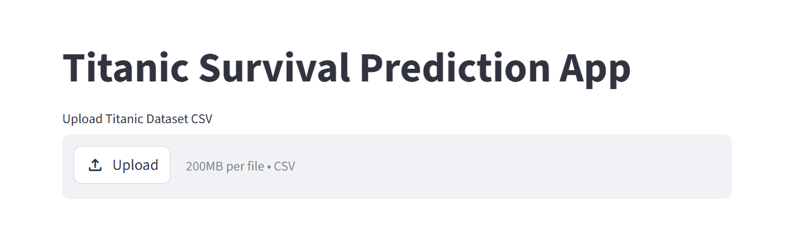
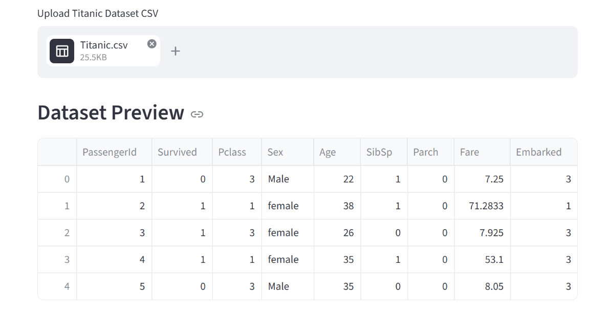
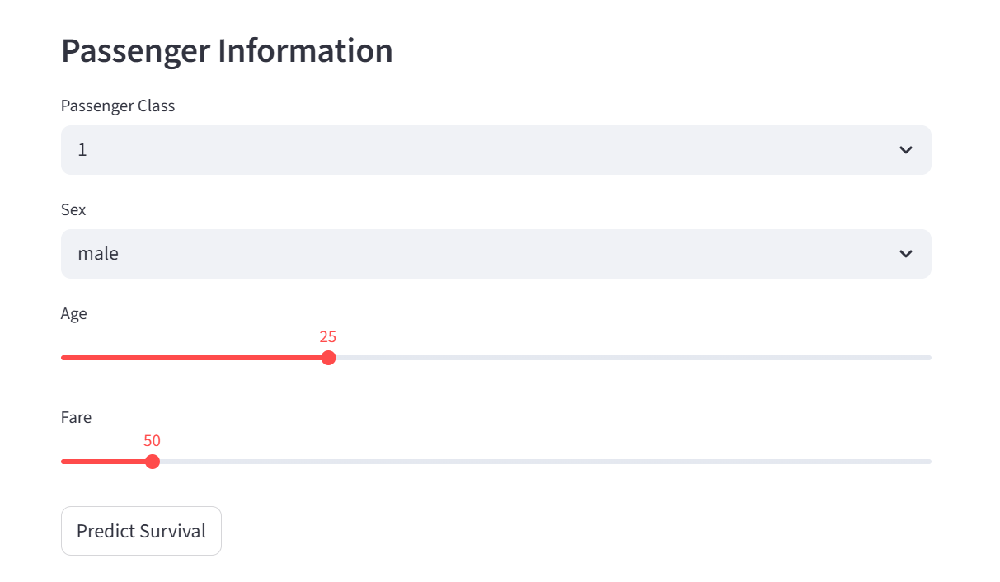
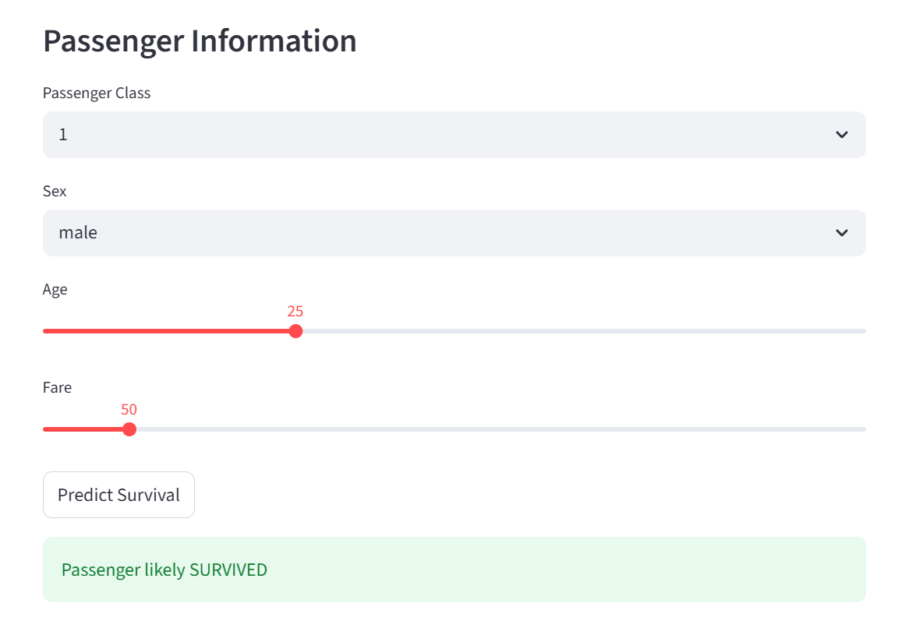

# 🚢 Titanic Survival Prediction App

🌐 **Live Demo:**
👉 https://titanic-survival-prediction-project-fmnrzgmkvwcd8f6gpe5sgn.streamlit.app/

---

## 📌 Overview

This project is a **Machine Learning web app** built with Streamlit that predicts whether a passenger survived the Titanic disaster based on their information.

---

## ✨ Features

* 📂 Upload Titanic dataset (CSV)
* 📊 Preview dataset instantly
* ⚙️ Select passenger inputs
* 🤖 Predict survival using ML model
* 📉 Clean and interactive UI
* ⚡ Fast predictions with Streamlit

---

## 📂 Dataset Features

The dataset includes:

* **PassengerId**
* **Survived** (Target)
* **Pclass** (Passenger Class)
* **Sex**
* **Age**
* **SibSp** (Siblings/Spouses)
* **Parch** (Parents/Children)
* **Fare**
* **Embarked**

---

## ⚙️ How It Works

1. Upload Titanic dataset
2. App processes data automatically
3. Enter passenger details:

   * Class
   * Gender
   * Age
   * Fare
4. Model predicts:
   👉 **Survived or Not Survived**

---

## 🤖 Model Details

* Algorithm: Logistic Regression / Classification Model
* Input Features:

  * Pclass
  * Sex
  * Age
  * Fare
* Output:

  * Survival Prediction

---

## 📸 Screenshots

### 🏠 Home Page



---

### 📊 Dataset Preview



---

### ⚙️ Passenger Input



---

### 🎯 Prediction Result



---

## 📦 Installation

```bash
git clone https://github.com/AlamgirKhan48692/titanic-survival-prediction-project.git
cd titanic-survival-prediction-project
pip install -r requirements.txt
streamlit run app.py
```

---

## ⚠️ Note

* This model is for **educational purposes**
* Accuracy depends on dataset quality
* Not intended for real-world decision making

---

## 🚀 Future Improvements

* Add more ML models (Random Forest, XGBoost)
* Improve UI design
* Add model comparison
* Deploy with database

---

## 👨‍💻 Author

**Alamgir Khan**
📘 https://github.com/AlamgirKhan48692

